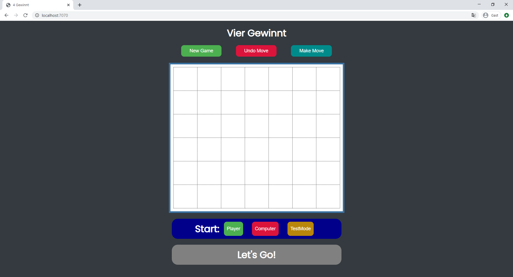

# 📖 Projektdokumentation (aus Uni-Projekt)

Im Folgenden die ausführliche Dokumentation (Regeln, Tests, Algorithmen, GUI, etc.) aus dem ursprünglichen Uni-Projekt.  

---

## Einleitung

Ein Kotlin Programm, dass das Spiel Vier gewinnt mithilfe des Javalin-Framework auf einem Server laufen lässt und im Browser per HTML, CSS und etwas Javascript grafisch darstellt.  
Es wird gegen einen Computergegner gespielt, der mithilfe eines Alpha Beta / Monte Carlo Hybrid Algorithmus implementiert ist und Züge ausführt.

---

### Spielregeln

Gespielt wird auf einem 7x6 Spielfeld. Die Spieler setzen immer abwechselnd einen Stein auf das Spielfeld. Der ziehende Spieler wählt eine Spalte aus, dort fällt der Stein ganz nach unten bzw. auf den untersten freien Platz der Spalte. Gewonnen hat der Spieler, der als erster vier Steine in einer Reihe hat (horizontal, vertikal oder diagonal). Ein unentschieden ist möglich wenn alle 42 Steine verbraucht sind und kein Spieler gewonnen hat.


### Bedienungsanleitung



Gestartet wird die Anwendung mit dem Befehl "gradle run".

Züge werden gemacht in dem man mit der Maus auf ein Feld in der entsprechenden Spalte klickt.
Nachdem ein Zug gemacht wurde antwortet der Computer automatisch mit einem Gegenzug.

Über dem Spielfeld befinden sich drei Buttons, "New Game" startet ein neues Spiel, "Undo Move" nimmt den letzten Spielzug zurück, "Make Move" lässt den Computer einen Zug ausführen, der durch den Alpha Beta Algorithmus berechnet wurde.

Unter dem Spielfeld kann zu beginn eines Spiels ausgewählt werden wer das Spiel starten soll.
"Player" wenn der Mensch(der Bediener) starten soll (nicht unbedingt notwendig, man kann auch direkt einen Zug per Mausklick machen),
"Computer" wenn der Computer den ersten Zug ausführen soll.

Bei einem klick auf den Button "TestMode" werden fünf Tests ausgeführt und auf der Konsole ausgegeben (siehe weiter unten), danach erscheinen in dieser Toolbar fünf Buttons mit denen jeweils ein Testszenario manuell durchgeführt werden kann um zu validieren dass der Computergegner "schlaue" züge macht.


### Dateiübersicht

    \build.gradle
    \README.md
    \screenshot.PNG
    \settings.gradle
    \src\main\kotlin\vierGewinnt_javalin\AlphaBeta_Negamax.kt
    \src\main\kotlin\vierGewinnt_javalin\GameToHTML.kt
    \src\main\kotlin\vierGewinnt_javalin\Interfaces.kt
    \src\main\kotlin\vierGewinnt_javalin\MonteCarlo.kt
    \src\main\kotlin\vierGewinnt_javalin\runTests.kt
    \src\main\kotlin\vierGewinnt_javalin\Server.kt
    \src\main\kotlin\vierGewinnt_javalin\Testszenarien.kt
    \src\main\kotlin\vierGewinnt_javalin\VierGewinnt.kt
    \src\main\resources\public\index.html
    \src\main\resources\public\script.js
    \src\main\resources\public\style.css

    -------------------------------------------------------------------------------
    Language                     files          blank        comment           code
    -------------------------------------------------------------------------------
    Kotlin                           8             68             23            555
    Markdown                         1             64              0            272
    CSS                              1             26              0            130
    HTML                             1              4              0             87
    JavaScript                       1              2              0             21
    Gradle                           2             11             24             19
    -------------------------------------------------------------------------------
    SUM:                            14            175             47           1084
    -------------------------------------------------------------------------------

## Spiel-Engine (ENG)

Feature    | AB  | H+S | MC  | DB  |  B+I | Summe
-----------|-----|-----|-----|-----|------|----
Umsetzung  | 120 |   0 | 100 |   0 | 66.6 |
Gewichtung | 0.4 | 0.3 | 0.3 | 0.3 |  0.3 |
Ergebnis   |  48 |  0  |  30 |   0 |   20 | **98%**

Das Herzstück der Spiel-Engine ist ein Alpha Beta Algorithmus in der Negamax Variante, der mit einer Monte Carlo Simulation verknüpft ist.
Der Alpha Beta Algorithmus durchsucht bis zu einer festen Tiefe von 5 alle Stellungen und bewertet sie.

Leitet sich aus einer der durchsuchten Stellungen garantiert ein Gewinn oder Verlust ab so wird dieser Pfad entweder verfolgt (also als bester zug zurückgegeben) oder vermieden.

Lässt sich aus einer Spielstellung keine eindeutige Bewertung ableiten wird zur Stellungsbewertung eine Monte Carlo Simulation verwendet, die ab der bestimmten Stellung 100 Simulationen durchführt (also Spiele zufällig bis zum Ende durchspielen lässt). Als Bewertungsparameter dient der prozentuale Anteil der Gewinne an den Simulationen, also wenn bei 100 Simulationen 50 Spiele Gewonnnen wurden beträgt der Bewertungsparameter 0.5. Je höher er ist desto mehr Wert hat dieser Zug statistisch gesehen bzw je höher die Gewinnchance daraus.

Durch Miteinbeziehung der Tiefe in die Bewertung werden direkte Gewinne realisiert und direkte Verluste vermieden.

Hier eine Übersicht der Bewertung der Spielstellungen:
* Gewinn = +20000 Punkte + (tiefe * 50)
* Verlust = -20000 Punkte - (tiefe * 50)
* Ansonsten: MonteCarlo (100 Simulationen) = ProzentualerGewinnanteil * 10000 Punkte (z.B. 0.5*10000 = 5000 Punkte)

Gleichwertige Züge werden in der Bewertungsfunktion durch einen gering gewichteten zufälligen Wert randomisiert (+/- 0-49 Punkte).

Der Algorithmus und die Bewertungsfunktion sind in der Datei "AlphaBeta_Negamax.kt" zu finden.
Die Monte Carlo Simulation befindet sich in "MonteCarloTreeSearch.kt".

Das Spielfeld ansich besteht aus jeweils einem Bitboard pro Spieler (64 Bit Long in Kotlin). Ebenso sind alle verwendeten Operationen (Züge machen, Züge zurücknehmen, auf Gewinn Testen) durch Bitoperationen realisiert, wodurch die Performance des Alpha Beta Algorithmus deutlich erhöht wird.

Als Vorlage für die Bitboards und Operationen diente mir Herr Herzbergs "Bitboards and Connect Four" Dokument (https://github.com/denkspuren/BitboardC4/blob/master/BitboardDesign.md).

Die komplette Spiellogik befindet sich in der Datei "VierGewinnt.kt".

Ich habe mit einer Simulationsanzahl von 250 eine leichte Verbesserung der Spielstärke erkennen können und auf meinem System auch Zugberechnungszeiten von deutlich unter einer Sekunde, meist unter 200ms erhalten. Damit die Anwendung aber auch auf etwas älteren oder leistungsschwächeren Maschinen flüssig läuft habe ich hier 100 als Simulationsanzahl gewählt und trotzdem noch einen sehr gut spielenden Gegner erhalten.
Wem das nicht reicht oder wer mehr Power im PC hat, der kann gerne die Simulationen auf 250 oder noch höher stellen (Parameter "simulations" in Zeile 11 der "Server.kt" Datei).

Das Spiel sowie die verwendeten Algorithmen sind durch Interfaces implementiert, die in der Datei "Interfaces.kt" zu finden sind.


## Tests (TST)

Szenario |  1  |  2  |  3  |  4  |  5  | Summe
---------|-----|-----|-----|-----|-----|-------
ok       |  X  |  X  |  X  |  X  |  X  | 1.0

Die Tests werden wie folgt ausgeführt:

Neues Spiel starten ("NewGame" Button) und den Button "TestMode" unter dem Spielfeld drücken.
Dann werden alle fünf Tests nacheinander ausgeführt und auf der Konsole Zug für Zug ausgegeben. Der zu testende Computerspieler ist immer Gelb (bzw. X) und beginnt zu ziehen.

Wenn man die Tests einzeln ausführen und auf der GUI nachvollziehbar angezeigt bekommen möchte, so kann man nachdem man auf "TestMode" geklickt hat auf den jeweiligen Button (Test1, Test2, ...) klicken um das entsprechende Testzenario in das Spielfeld zu laden.
Nun muss man nur noch Zug für Zug "MakeMove" klicken, wenn der gelbe Spieler am Zug ist um ihn zu testen. So können die Tests grafisch Zug für Zug analysiert werden (auch mit z.b. Zügrücknahme). Der blaue Spieler kann entweder selbst bedient oder mit "MakeMove" auch vom Algorithmus gesteuert werden.

Bei der Protokollierung kann es zu leichten Abweichungen kommen, da der Gegner auch den programmierten Algorithmus verwendet um zu ziehen und somit bei gleichwertigen Zügen einen zufälligen Zug auswählt. Dies ändert jedoch nichts an der Validität der Tests, da die Spielfelder so aufgebaut sind, dass die entsprechenden Tests der Sichttiefen immer sichergestellt sind.

Die Testausführung protokolliert sich über die Konsole wie folgt:

    Test1 - Spiel-Engine kann im naechsten Zug gewinnen (Sichttiefe 1):
    [. . . . . . . ]
    [. . . . . . . ]
    [. . . . . . . ]
    [. . . . . . . ]
    [. . . . . . . ]
    [O O O X X X . ]
    1 2 3 4 5 6 7
    Test-AI-Move (Tiefe1): 7
    [. . . . . . . ]
    [. . . . . . . ]
    [. . . . . . . ]
    [. . . . . . . ]
    [. . . . . . . ]
    [O O O X X X X ]
    1 2 3 4 5 6 7

    Test2 - Spiel-Engine kann im uebernaechsten Zug gewinnen (Sichttiefe 3)
    [. . . . . . . ]
    [. . . . . . . ]
    [. . . . . . . ]
    [. . . . . . . ]
    [. . . . . . . ]
    [O O . X X . . ]
    1 2 3 4 5 6 7
    Test-AI-Move (Tiefe1): 6
    [. . . . . . . ]
    [. . . . . . . ]
    [. . . . . . . ]
    [. . . . . . . ]
    [. . . . . . . ]
    [O O . X X X . ]
    1 2 3 4 5 6 7
    Gegner-AI-Move (Tiefe2): 3
    [. . . . . . . ]
    [. . . . . . . ]
    [. . . . . . . ]
    [. . . . . . . ]
    [. . . . . . . ]
    [O O O X X X . ]
    1 2 3 4 5 6 7
    Test-AI-Move (Tiefe3): 7
    [. . . . . . . ]
    [. . . . . . . ]
    [. . . . . . . ]
    [. . . . . . . ]
    [. . . . . . . ]
    [O O O X X X X ]
    1 2 3 4 5 6 7

    Test3 - Spiel-Engine kann im ueberuebernaechsten Zug gewinnen (Sichttiefe 5)
    [. . . . . . . ]
    [. . . O . . . ]
    [. . O X . . . ]
    [. . X X O . . ]
    [O . O X X O X ]
    [X . X O O X O ]
    1 2 3 4 5 6 7
    Test-AI-Move (Tiefe1): 1
    [. . . . . . . ]
    [. . . O . . . ]
    [. . O X . . . ]
    [X . X X O . . ]
    [O . O X X O X ]
    [X . X O O X O ]
    1 2 3 4 5 6 7
    Gegner-AI-Move (Tiefe2): 1
    [. . . . . . . ]
    [. . . O . . . ]
    [O . O X . . . ]
    [X . X X O . . ]
    [O . O X X O X ]
    [X . X O O X O ]
    1 2 3 4 5 6 7
    Test-AI-Move (Tiefe3): 2
    [. . . . . . . ]
    [. . . O . . . ]
    [O . O X . . . ]
    [X . X X O . . ]
    [O . O X X O X ]
    [X X X O O X O ]
    1 2 3 4 5 6 7
    Gegner-AI-Move (Tiefe4): 6
    [. . . . . . . ]
    [. . . O . . . ]
    [O . O X . . . ]
    [X . X X O O . ]
    [O . O X X O X ]
    [X X X O O X O ]
    1 2 3 4 5 6 7
    Test-AI-Move (Tiefe5): 2
    [. . . . . . . ]
    [. . . O . . . ]
    [O . O X . . . ]
    [X . X X O O . ]
    [O X O X X O X ]
    [X X X O O X O ]
    1 2 3 4 5 6 7

    Test4 - Spiel-Engine vereitelt eine unmittelbare Gewinnbedrohung des Gegners (Sichttiefe 2)
    [. . . . . . . ]
    [. . . . . . . ]
    [. . . . . . . ]
    [. O . . . . . ]
    [. O . X . . . ]
    [. O . X X . . ]
    1 2 3 4 5 6 7
    Test-AI-Move (Tiefe1): 2
    [. . . . . . . ]
    [. . . . . . . ]
    [. X . . . . . ]
    [. O . . . . . ]
    [. O . X . . . ]
    [. O . X X . . ]
    1 2 3 4 5 6 7
    Gegner-AI-Move (Tiefe2): 6
    [. . . . . . . ]
    [. . . . . . . ]
    [. X . . . . . ]
    [. O . . . . . ]
    [. O . X . . . ]
    [. O . X X O . ]
    1 2 3 4 5 6 7

    Test5 - Spiel-Engine vereitelt ein Drohung, die den Gegner im uebernaechsten Zug ansonsten einen Gewinn umsetzen laesst (Sichttiefe 4)
    [. . . . . . . ]
    [. . . . . . . ]
    [. . . . . . . ]
    [. . . . . . . ]
    [. . . O O . . ]
    [. X O X X O X ]
    1 2 3 4 5 6 7
    Test-AI-Move (Tiefe1): 6
    [. . . . . . . ]
    [. . . . . . . ]
    [. . . . . . . ]
    [. . . . . . . ]
    [. . . O O X . ]
    [. X O X X O X ]
    1 2 3 4 5 6 7
    Gegner-AI-Move (Tiefe2): 2
    [. . . . . . . ]
    [. . . . . . . ]
    [. . . . . . . ]
    [. . . . . . . ]
    [. O . O O X . ]
    [. X O X X O X ]
    1 2 3 4 5 6 7
    Test-AI-Move (Tiefe3): 3
    [. . . . . . . ]
    [. . . . . . . ]
    [. . . . . . . ]
    [. . . . . . . ]
    [. O X O O X . ]
    [. X O X X O X ]
    1 2 3 4 5 6 7
    Gegner-AI-Move (Tiefe4): 4
    [. . . . . . . ]
    [. . . . . . . ]
    [. . . . . . . ]
    [. . . O . . . ]
    [. O X O O X . ]
    [. X O X X O X ]
    1 2 3 4 5 6 7

Hier eine übersicht der Tests:
1. Die Spiel-Engine kann im nächsten Zug gewinnen (Sichttiefe 1)
-   Spielengine muss in Spalte 7 setzen um direkten Sieg zu realisieren.
2. Die Spiel-Engine kann im übernächsten Zug gewinnen (Sichttiefe 3)
-   Spielengine muss zuerst in Spalte 6, dann in 3 oder 7 setzen um Sieg zu realisieren (jenachdem wie Gegner zieht).
3. Die Spiel-Engine kann im überübernächsten Zug gewinnen (Sichttiefe 5)
-   Spielengine muss zuerst in Spalte 1 setzen um Sieg zu realisieren (dadurch entweder diagonal von unten links beginnend, oder horzintal in Reihe 3 Sieg möglich, je nachdem wie Gegner zieht).
4. Die Spiel-Engine vereitelt eine unmittelbare Gewinnbedrohung des Gegners (Sichttiefe 2)
- Spielengine muss in Spalte 2 setzen um direkte Niederlage zu verhindern.
5. Die Spiel-Engine vereitelt ein Drohung, die den Gegner im übernächsten Zug ansonsten einen Gewinn umsetzen lässt (Sichttiefe 4)
-   Spielengine muss in Spalte 3 oder 6 setzen um Niederlage in Sichttiefe 4 zu verhindern.

Die vorgefertigten Spielfelder zu den Tests befinden sich in der Datei "Testszenarien.kt" und können auch dort bearbeitet werden. Man kann dort auch neue Testspielfelder erstellen, allerdings sollte man sie dann "händisch" per "MakeMove" ausführen oder z.B. eine Funktion schreiben, die nacheinander Züge macht und dafür Algorithmus benutzt (siehe "runTests.kt" als Beispiel).

## Umsetzung der GUI

Die GUI ist im Browser zu bedienen und mithilfe von HTML, CSS und etwas Javascript realisiert.
Das HTML Dokument besteht aus einem festen Kernskellet (Überschrift + drei Buttons über dem Spielfeld), sowie einem 'div class="gameContainer"' der immer wieder aktualisiert bzw ausgetauscht wird. Dieser gameContainer ist sozusagen der dynamische Teil der Seite und enthält Spielfeldrepräsentation sowie die zwei Toolboxen darunter.

Beim Laden der Seite (des HTML Dokuments) wird via Javascript ein GET-Request an den Server gesendet um den aktuellen gameContainer (das aktuelle Spielfeld) zu erhalten. Der Server antwortet mit HTML Code der den aktuellen gameContainer, also das aktuelle Spielfeld repräsentiert. Diese Antwort wird dann per Javascript auf Clientseite in das HTML Dokument eingebaut, bzw der der komplette Code in "gameContainer" wird per Javascript ".innerHTML" funktion mit der erhaltenten Antwort ausgetauscht.


Das Spielfeld ist grafisch als HTML Tabelle mit 6 Reihen mit jeweils 7 Spalten dargestellt.
Ein Stein wird innerhalb der Tabelle in der jeweiligen Zelle als 'div class="playerO"' oder 'div class="playerX"' dargestellt und per entsprechendem CSS sichtbar gemacht bzw gestyled.

Bei einem Klick auf eine Zelle des Spielfelds wird ein GET-Request '/move?col='+ Nummer der jeweiligen Spalte ausgeführt um dem Server zu sagen das ein Zug gemacht werden soll. Dann wird auf dem Server versucht den Zug im Spiel auszuführen und die Antwort des Servers ist dann eine aktualisierte Version des Spielfelds, die dann wieder auf Clientseite ausgetauscht bzw eingebaut wird.

Die Buttons funktionieren auf die gleiche Art und Weise, es wird ein Request gesendet und die Antwort ist eine aktualisierte Version des Spiels bzw gameContainers. Die Antwort wird dann wieder per Javascript clientseitig in das HTML Dokument eingebaut.

Optisch etwas ansprechend ist alles mit ein wenig CSS gemacht (siehe style.css).

## Hinweise
Am besten per "gradle run -q --console=plain" starten damit man die Tests auf der Konsole gut nachvollziehen kann.


gradle uses lokal machine (eg windows) gradle installation
./gradlew uses projekt setup gradle version

```./gradlew run -q --console=plain```

```./gradlew jar```
```./gradlew run```

```./gradlew jar | java -jar .\build\libs\vier-gewinnt-new-1.0.jar```


## Quellennachweis

* https://de.wikipedia.org/wiki/Vier_gewinnt
* https://de.wikipedia.org/wiki/Alpha-Beta-Suche
* https://github.com/denkspuren/BitboardC4/blob/master/BitboardDesign.md (Design der Bitboards +     Grundlegende Spielmethoden so übernommen und in Kotlin übersetzt)
* https://spin.atomicobject.com/2017/07/08/game-playing-ai-bitboards/
* https://www.w3schools.com/css/css3_buttons.asp (teilweise Button styling)
* https://drive.google.com/file/d/14NlA5OuevYMdioL4Hqqt26z1nq33jwMY/view (Tic-Tac-Toe programmieren - Eine Anleitung, von Dominikus Herzberg)


