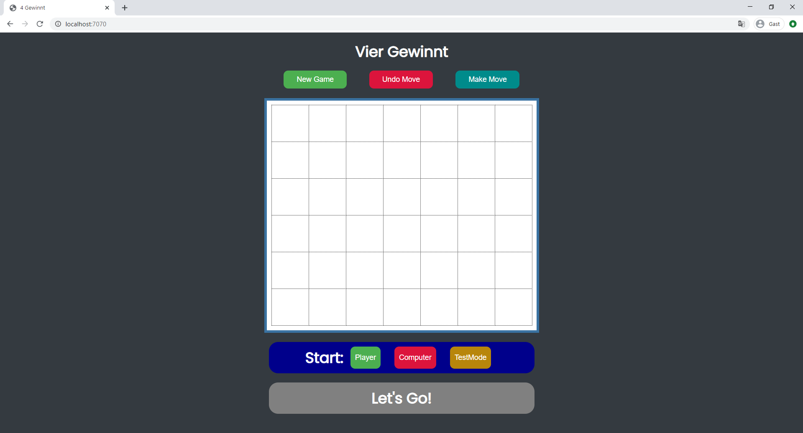

# Connect Four 🎮

A **Connect Four** game implemented in **Kotlin** with a **Javalin web server** and an **Alpha-Beta / Monte Carlo hybrid AI** as computer opponent. The application runs in the browser using **HTML/CSS** and minimal **JavaScript**. Deployment is containerized via **Docker** on **Google Cloud Run**, with **CI/CD via GitHub**.

## 🎮 Live Demo
👉 **[Play Connect Four](https://vier-gewinnt-javalin-734133816982.europe-west1.run.app/)**

---

## 🚀 Tech Stack
- **Backend:** Kotlin, Javalin Framework
- **Frontend:** HTML, CSS, minimal JavaScript
- **Communication:** WebSockets (Server ↔ Client)
- **AI:** Alpha-Beta-Search (Negamax) + Monte Carlo Simulation
- **Deployment:** Docker, Google Cloud Run
- **CI/CD:** GitHub Push → Build & Deploy on GCP (`./cloudbuild.yaml`)

---

## ✨ Key Features
- **Intelligent AI:** Hybrid Alpha-Beta/Monte Carlo algorithm with 5-level deep search
- **Real-time gameplay:** WebSocket-based communication for instant moves
- **Production-ready:** Dockerized deployment with automated CI/CD pipeline
- **Performance optimized:** Bitboard implementation for efficient game state handling
- **Fast AI computation:** 100-game Monte Carlo simulation


---

## 🛠️ Development

### Prerequisites
- JDK 11+
- Gradle 7+

### Local Development
```bash
# Clone and run
git clone https://github.com/timbkr/Vier-Gewinnt-Javalin
cd Vier-Gewinnt-Javalin
./gradlew run

# With Docker
docker build -t connect-four .
docker run -p 8080:8080 connect-four

```
After that, the app is available at `http://localhost:8080`.

---

### Testing
The AI includes 5 comprehensive test scenarios validating different search depths and strategic decisions. Access via "TestMode" button in the game interface:
- Direct win detection (depth 1)
- 2-move ahead wins (depth 3)
- 3-move ahead wins (depth 5)
- Immediate threat blocking (depth 2)
- Advanced threat prevention (depth 4)

---

## 📖 Documentation
**Full project documentation (rules, tests, algorithms, GUI, etc.):**
👉 [DOCUMENTATION.md](./DOCUMENTATION.md)

---




